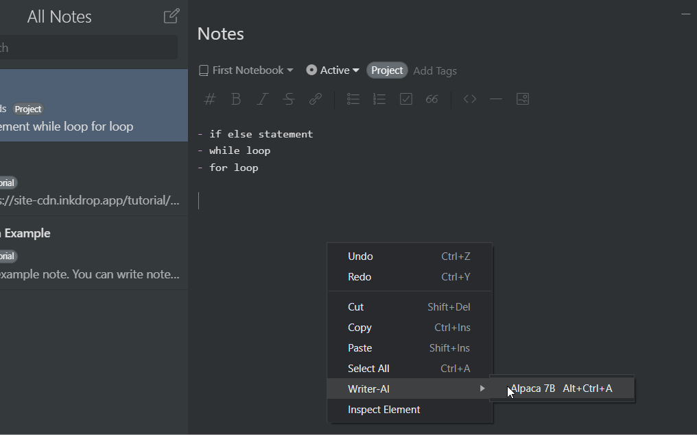

# Writer AI Plugin for Inkdrop
The Writer AI plugin for Inkdrop adds artificial intelligence (AI) functionality to your note-taking workflow. Powered by the Alpaca AI model, this plugin allows you to perform various AI tasks directly in your Inkdrop notes, without leaving your local system.




## Features

- Natural Language Generation: Generate natural-sounding text based on prompts or existing text.
- Text Summarization: Summarize long texts to extract the main points.
- Text Completion: Automatically complete text based on what you've already written.
- Sentiment Analysis: Analyze the sentiment of a piece of text and get a score.
- Topic Modeling: Identify the main topics in a piece of text and get a list of keywords.

> Modify Instructions Option in plugins settings to have this possible features or thers to you liking

## Requirements

To use this plugin, you need to have the following software installed on your local system:

- Inkdrop
- Nodejs
- [Dalai](https://github.com/cocktailpeanut/dalai) (make sure Dalai server is on and you have alpaca 7B modal installed)


## Installation
1. ### Get Plugin First
    install [Writer-AI](https://my.inkdrop.app/plugins/writer-ai) in you inkdrop 

2. ### Install Model(s) 
    
    We will install Alpaca Model 7B  you can Install other models (7B 13B  65B) (You can select a model to use from the plugin settings default:Alpaca7B)
    ```
    # Install alpaca 7B model
    npx dalai alpaca install 7B
    ```

2. ### Start Dalai server (You have to start the server every time you wanna use writer-ai)
    Run this command - this starts the socket Io server on "localhost:3000"
    ```
    # Run dalai server
    npx dalai serve
    ```


## Keybindings

| Keybinding | Description                      |
| ---------- | -------------------------------- |
| Ctrl-Alt-A | Starts the magic                 |


## License

This plugin is released under the MIT License.